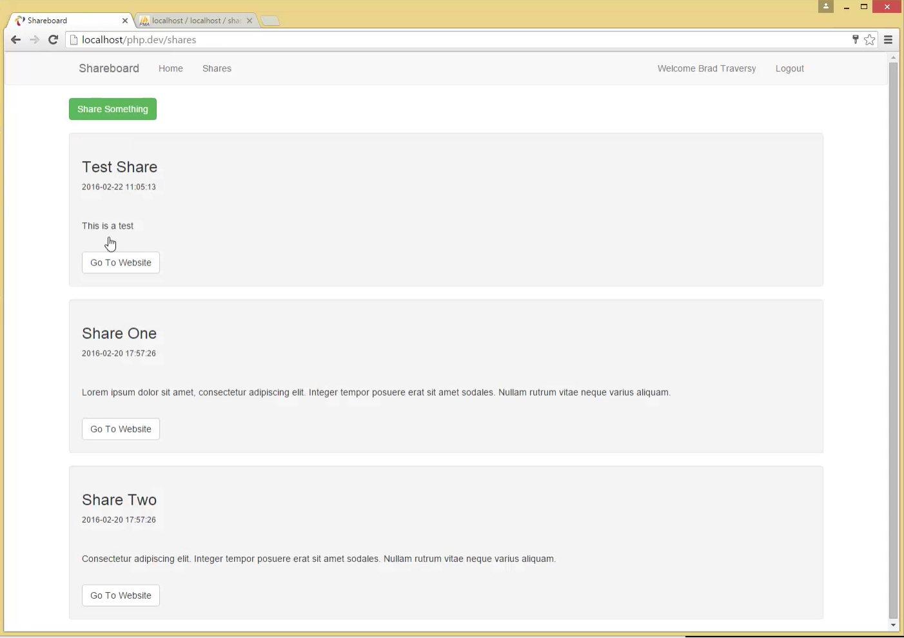
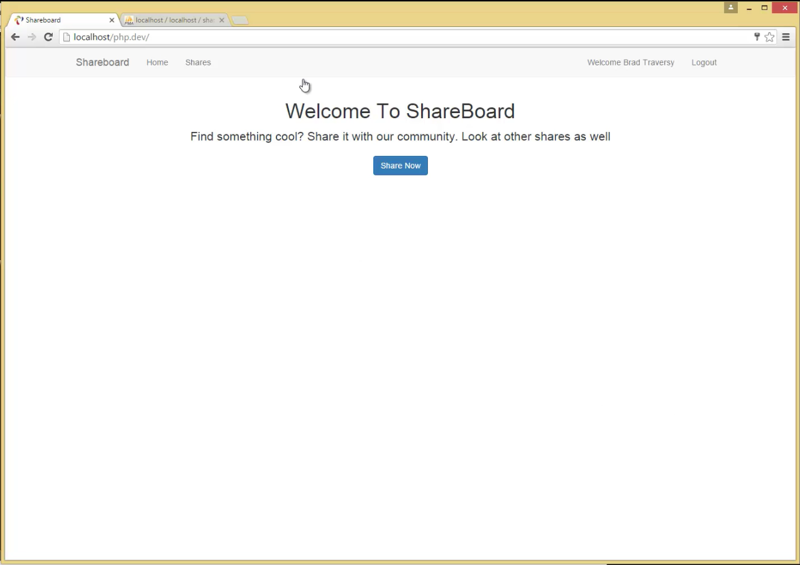

This is a simple and dynamic PHP website built using OOP in PHP5.5 that allows users to register, login and create "shares" which are mini-posts with a title, body and a link to some other website.

THe features include:

1) A completely custom MVC framework
2) Fully Object Oriented code
3) User login and verification
4) Beautiful alert messages
5) Access control for not logged in users
6) Session maintenance
7) Database integration
8) Proper folder structure and bootstrap classes

Screenshots:
============
1) All the shares

 

2) User login

 

3) The home screen

 

4) Registration verification

 

5) Adding a new share

 

6) Access control (Non logged in users can't add new shares. "Share Something" button from screenshot 1 is not shown here.)

 
